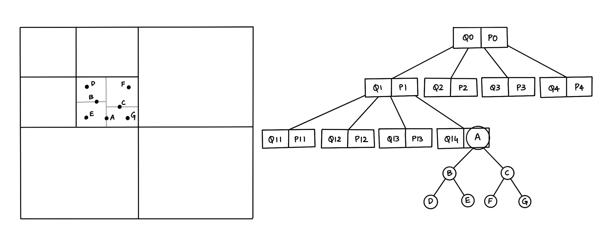
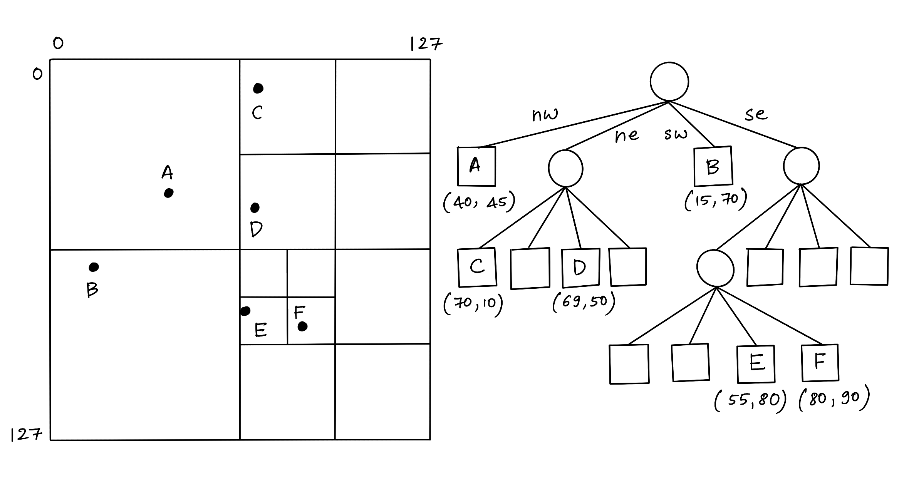
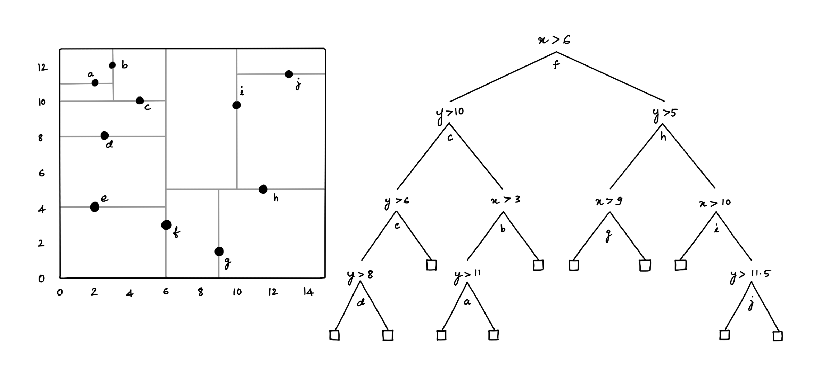

# Hybrid Spatial Data Structure based on KD Tree and Quad Tree 🚀

- Research Paper: [A Proposed Hybrid Spatial Data Structure based on KD Tree and Quad Tree](https://www.researchgate.net/publication/339433736_A_Proposed_Hybrid_Spatial_Data_Structure_based_on_KD_Tree_and_Quad_Tree)
- Medium Post: [Hybrid Spatial Data Structure based on KD-tree and Quadtree](https://pyblog.medium.com/hybrid-spatial-data-structure-based-on-kd-tree-and-quadtree-8c0c5eebdbbf)

## Hybrid Tree

A hybrid tree data structure that combines the features of Quadtree and the KD-tree.
The below figure shows a hybrid structure with seven points inserted in a map, so the map is divided into four parts according to the quadtree structure, and each part is subdivided into four parts. If one part has a line or polygon stored in a quadtree structure, but other parts contain points, we use a KD-tree structure inside this part to store the location of each point

## Quad Tree

In a Quadtree, each node represents a bounding box covering some part of the space being indexed, with the root node covering the entire area. Each node is either a leaf node that contains one or more indexed points and no children, or it is an internal node with exactly four children, one for each quadrant obtained by dividing the area covered in half along both axes

## k-dimensional Tree

The KD-tree can be used to index a set of k-dimensional points. Every non-leaf node divides the space into two parts by a hyper-plane in the specific dimension. Points in the left half-space are represented by the left subtree of that node, and points falling to the right half-space are represented by the right subtree

